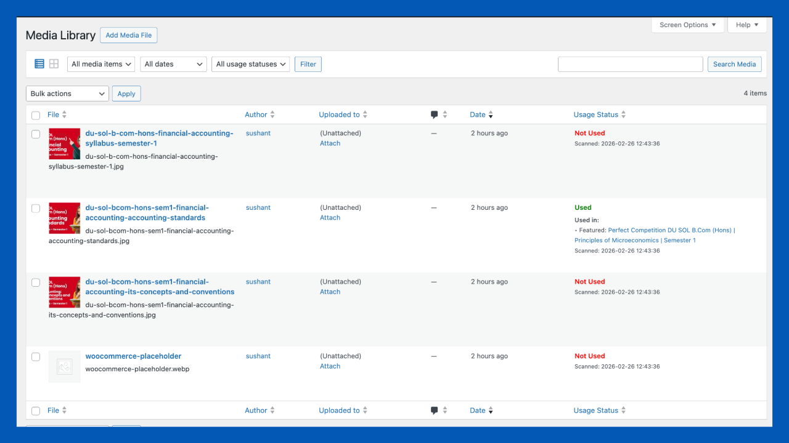
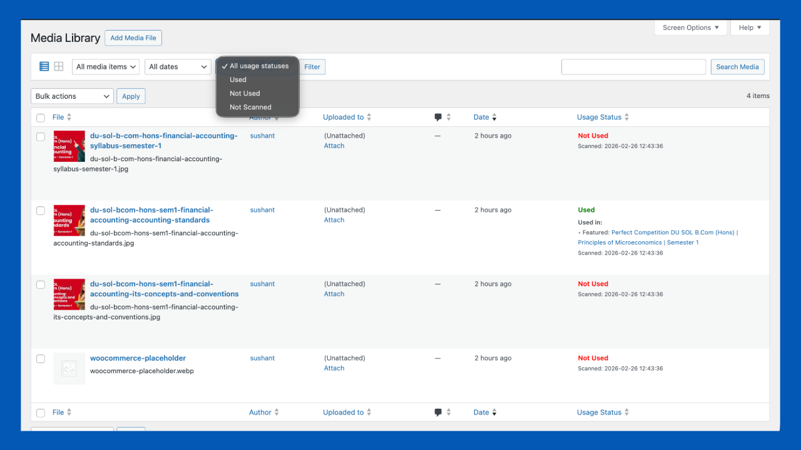
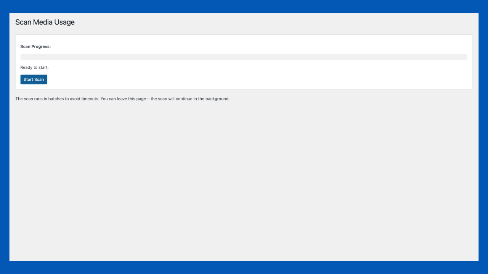
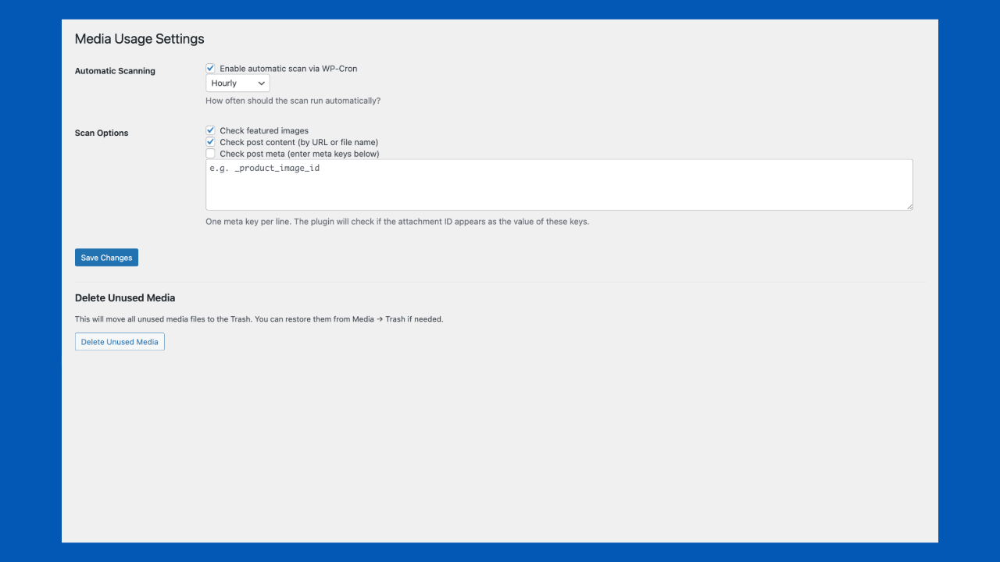

# Sushant Media Scanner


A lightweight, open-source WordPress plugin that helps website owners detect unused media files, identify duplicate assets, and optimize their Media Library safely.

## ✨ Features

- 🔍 Detect unused media files
- 🎯 See exactly where an image is used
- ⚡ AJAX-powered batch scanning
- 📅 Scheduled scans using WP-Cron
- 🧩 Elementor & Page Builder support
- 🛡 Safe cleanup (Trash instead of permanent deletion)
- 🚀 Lightweight & performance focused
- 🔒 Privacy friendly (no external servers)

---

## Screenshots

| Dashboard | Scan Results |
|-----------|--------------|
|  |  |

| Media Library | Settings |
|--------------|----------|
|  |  |

---

## Installation

### From WordPress Admin

1. Go to **Plugins → Add New**
2. Search for **Sushant Media Scanner**
3. Install and Activate

### Manual Installation

1. Download the plugin.
2. Upload it to `/wp-content/plugins/`
3. Activate the plugin.
4. Navigate to:

```
Media → Scan Media Usage
```

---

## Requirements

- WordPress 5.8+
- PHP 7.4+

---

## Plugin Directory

https://wordpress.org/plugins/sushant-media-scanner/

---

## Documentation

https://thesushant.in/sushant-media-scanner

---

## Author

**Sushant Kumar**

- Website: https://thesushant.in
- Portfolio: https://thesushant.in/portfolio
- LinkedIn: https://linkedin.com/in/myselfsushaant

---

## License

Licensed under **GPL-2.0**.

This project is open source and may be modified and redistributed under the terms of the GNU General Public License v2.0 or later.
